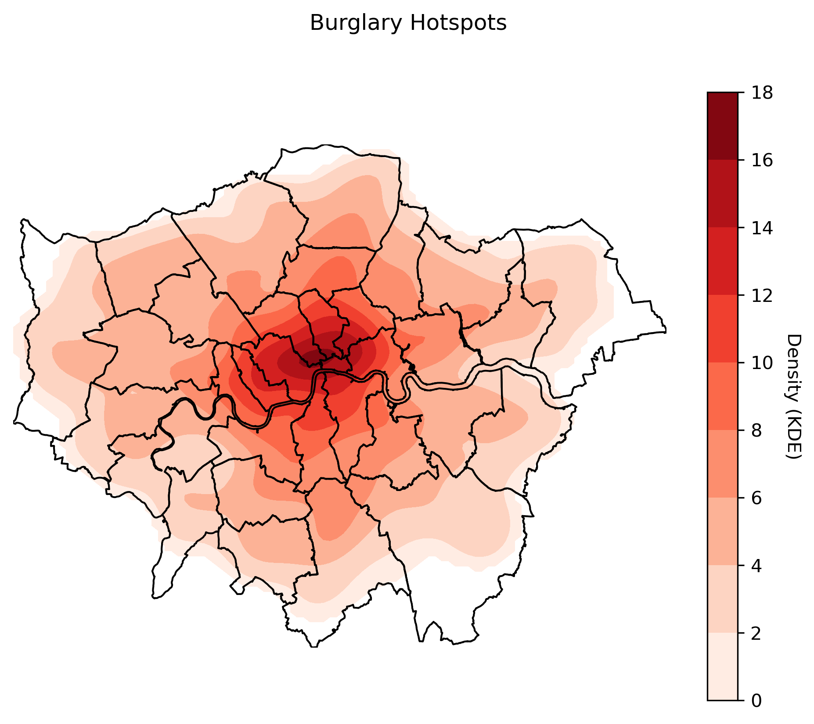

# Crime Data Mapping and Spatial Regression

[](https://github.com/mushtary-mumu/crime_patterns/actions?query=branch%3Amain) [](https://codecov.io/gh/mushtary-mumu/crime_patterns)

[](https://results.pre-commit.ci/latest/github/mushtary-mumu/crime_patterns/main)
[](https://github.com/psf/black)

## Project Title 
> ## **Burglary Crime Patterns and its Driving Factors in the City of London**
> #### *Effective Programming Practices for Economists Final Project, University of Bonn WS 22/23*
>

> #### Author
> **Mudabbira Mushtary**  
*Student of M.Sc. Economics*  
University of Bonn  
&copy; 2022-2023

## Project Description

This project analyzes the burglary crime patterns in the city of London, England's highest crime-rate city.
As a first step the crime data from the [City of London Police](https://data.police.uk/data/) and the [Metropoliton Police Service](https://data.police.uk/data/) along with the [English indices of deprivation 2019](https://www.gov.uk/government/statistics/english-indices-of-deprivation-2019) 
are downloaded, extracted and cleaned.  The next step involves a series of analysis on the burglary crime data and the indices of deprivation in order to answer certain research questions as listed below: 
- Spatial Point Pattern Analysis
  - Where are the burglary crime incidents located in the City of London?
  - Are the burglary incidents clustered in certain areas?
  - Where are the burglary hotspots located?
- Spatial Autocorrelation
  - Q1
  - Q2
  - Q3
- Spatial Regression.
  - Q1
  - Q2
  - Q3

The primary goal of the project is placed on reproducibility of the results by utilizing the research-software programming best-practices learned in the course "Effective Programming Practices for Economists" taught at the University of Bonn. 

## Getting started

For a local machine to run this project, it needs to have a Python and LaTeX distribution.
The project was tested on Windows 11 operating system.

The project environment includes all the dependencies needed to run the project.

To run this project on a local machine:
 - after cloning the repo, open a terminal in the root directory of the project and create and activate the environment typing:
  
```console
conda env create -f environment.yml
conda activate crime_patterns
```
 - To generate the output files that will be stored in `bld` folder, type `pytask` in the root directory of your terminal.
```console
pytask
```

## Project structure

`src` directory includes all the necessary code used in the analysis. To navigate through the folders, the workflow is decomposed as follows:
 - `src/crime_patterns/data` contains the raw data files that have been downloaded and extracted.
 - `src/crime_patterns/data_management` contains the code to clean and format the data for the subsequent analysis.
 - `src/crime_patterns/analysis` contains code for all the analysis mentioned above, intuitively named in separte files.
 - `src/crime_patterns/final` includes code to generate final tables and figures.
 - `src/crime_patterns/paper` contains the LaTex files and task to generate the final project paper.
<!--- - `documentation` generates pdf and html files for the documentaion of the project code. --->
 - `tests` tests the functions in `src`.

## Credits

This project was created with [cookiecutter](https://github.com/audreyr/cookiecutter)
and the
[econ-project-templates](https://github.com/OpenSourceEconomics/econ-project-templates).
